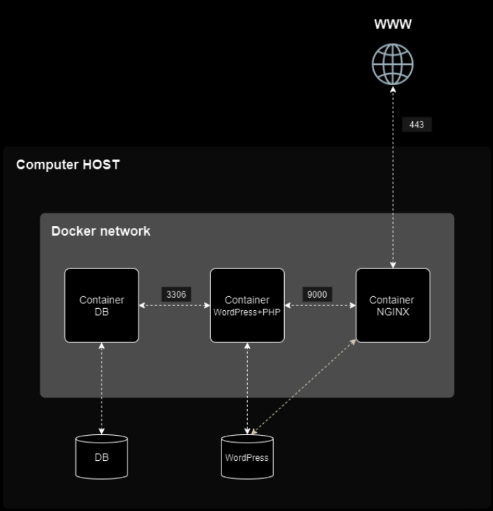

## MariaDB


***

### What MariaDB actually is

MariaDb is a **Relational database management system (RDBMS)** -- software that stores structed data in tables (rows/columns), lets us query it with SQL, and enforces relationships/constrains between tables. It's a **fork of MYSQL**, created in 2009 after Oracle acquired MySQL -- a group of the original MySQL developers forket it to keep it fully open-source and community-foverned, worried about Oracle's direction.

#### Why it's still essentially a MySQL-compatible drop-in

For most practical purposes -- including WordPress, which was oringally  built against MYSQL -- MariaDB speaks the same **wire protocol**, supports the same **SQL dialect** (with its own extensions added over time), and uses the same client tools/commands (``mysql``, ``mysqldump``, even the binary is oftern just called ``myqsl`` or aliased).
This is precisely why WordPRess can connect to MariaDB without needing any WordPRess-specific code changes -- as far as WordPress's database layer is concerned, it's just talking to "a MySQL-speaking server".

#### The client-server model

MariaDB runs as a **server process** (``maradbd``, historically ``mysqld``) that listens on a port (default 3306) and accepts connections from clients -- these could be command-line tools, or, in our case, **WordPress's PHP code itself acting as a client**, opening a connection, sending SQL queries, getting results back. This is a fundamentally different interaction pattern than NGINX/HTTP: it's a persistent, stateful connection with a request/response protocol of its own (not HTTP at all), authenticated at connection time with a username/password.

#### Where it fits in our architecture

If we look back at the subject's diagram:
***

***
MariaDB talks to **WordPress + PHP** only, over port 3306, entirely inside the Docker network -- never directly to NGINX, never exposed outside. This mirrors exactly the "***only NGINX is the entrypoint***" principle.
MariaDB is the most sensitive component (it holds all actual site data -- posts, user credentials, everything), so it sits at the deepest, most isolated layer. If WordPRess's PHP layer is compromised, the attacker still only rearches MariaDB through whatever queries WordPress's own code is willing to execute -- they don't get a direct, unmediated connection to the database from outside.

#### Why MariaDB specifically needs a volume

Containers are ephemeral by default -- if we ``docker compose down`` and ``up`` again, we get a **fresh container**, fresh writable layer, and anything written to the container\s own filessystem (not a volume), is gone.
A database is the textbook case where this is catastrophic -- losing all our WordPRess data every restart would make the whole project pointless. This is exactly why the subject mandates a **named volume** for MariaDb's data directory specifically: the actual database files need to live outside the container's disposable layer, on the host, surviving container recreation entirely.
***

### Users & Privileges Thoery

#### The core model

MariaDB's authenitcation/authorization system revolves around three things: **who** is connecting (user), from **where** they're allowed to connect (host), and **what** they're allowed to do once connected (privileges/grants).

#### User identity is actually ``user@host``, not just a username

In MySQL/MariaDB, a "user" isn't just a username string -- it's a **combination of username AND the host they're connecting from.
``wp_user@'172.18.0.3'`` and ``wp_user@'localhost'`` are treated as two **completely seperate accounts**, even with the identical username, potentially with different password and different rpivileges. the ``%` character is a wildcard, meaning "***any host***" -- so ``wp+user@'%'`` means that username con connect from anywhere.

WordPress's container connects to MariaDB over the Docker network, not from ``localhost`` inside the MariaDB container itself. So when we create the WordPRess DB user, we need to grant it access from the right host pattern -- typically ``%`` (any host) or more precisely the Docker network's subnet, since the actual source IP will be whatever address WordPRess's container gets assigned on the ``inception`` network, not something fixed can predict in advance. We will use ``%`` practically, accepting the minor broadening since DB isnt reachable from outside the network anyway.
***

#### Privileges -- what "***grants***" actually control

A privileg is permission to perform a specific operation (``SELECT``, ``INSERT``, ``UPDATE``, ``DELETE``, ``CREATE``, ``DROP``, etc...). On a specific scope (a specific database, table or globally across everything). The SQL command ``GRANT`` assign these:

```
GRANT ALL PRIVILEGES ON wordpress_db.* TO 'wp_user'@'%';
```

This reads as: give ``wp_user``, connecting from anywhere, full privileges, scoped only to the ``wordpress_db`` database (the ``.*`` means "***all tables within it***") -- not global privilegse across the whole MariaDB server. This scoping matters: a compromised WordPress instance with DB credentials limited to its own database can't touch other databses or server-wide settings. even if it wanted to.

**Why the subject wants two users specifically**
-> ***there must be two users, one of them being the administrator***.

This maps onto two different roles that exist at two different layers:

* The **MariaDB-level database user** -- this is who/what WordPress's PHP code authenticate as to the database itself, to run SQL queries. This user needs privilegs on the WordPRess database.

* The **WordPress-level application user** -- this is a login account, for the WordPress **website's own admin panel** (``/wp-admin``), completely separate from databse authentication. This is the one with **admin/administrator username restiction** --  it's a WordPress application-layer account, not a MariaDB account.

Thus "two users" in the subject's wording actually spans these two different layers -- re-reading the subject's phrasing, the practical requirement is: Our WordPress database needs **two dstinct DB-level accounts** (this is MariaDB's job), and sparately, among WordPress's **own application-level account**. One must be an administrator with a compliant (non-admin-pattern) username.
***

#### Root user -- the other critical account

MariaDB also has a built-in **root** superuser with unrestricted privileges across the entire server -- this is set via seperate root password (our ``sevrets/db_root_password.txt`` from the subject's example structure), distinct from the WordPress-specific user's password (``secrets/db_password.txt``). Root should never be what WordPress connects as -- WrodPress gets its own scoped-down user precisely so a compromise doesn't hand over full database server control
***
### The Initialization Problem

#### What "***initializing***" a MariaDB instance means:

A freshly  installed MariaDB **binary** doesn't  know how to store data yet -- it needs an actual on-disk data structure to exist at ``/var/lib/mysql`` before it can start: system database (``mysql``, holding all the privilege tables -- who's allowed to log in as what, from where, with what permissions), and the physical files representing that sructure. The initialization step -- historically done via toold called ``mysql_install_db``, though modern MariaDB often does this automatically on first ``mariadbd`` startup if the data directory is emty -- creates all of that from scratch.

**Critically**: this needs to happen exactly once per "***database instance's lifetime***", not once per container start, if we ran intialization everytime the container started, we'd **wipe and recreate the entire database from scratch on every restart** -- destroying all our WordPress data, defeating the entire purpose of the volume.
***

We need our container's startup logic to answer one question before doing anything else: ***Does ``/var/lib/mysql`` already contain an initialized database, or is it empty/fresh ?***

* **If empty** (first run ever): run initialization, create the WordPress database, create the two required users with correct privielges, set the root password -- all the one-time setup -- then start ``mariadbd`` normally.

* **If already initialized** (any subsequent run): skip all of that entirely, just start ``mariadb`` directly against the existing data.

#### Why a plain ``ENTRYPOINT ["mariadbd"]`` isnt' enough ?

Even setting aside te one-time-setup problem -- just running ``mariadbd`` directly, with nothing else, has no mechanims to ever create our WordPRess database or our two custom users in the first place. Those don't exist anywhere by default; they're specific to our project's requiements, and something has to actually issue the SQL (``CREATE DATABASE``, ``CREATE USER``,``GRANT``) to bring them into existence. That "something" has to be **scripted logic we will write ourselves**, conditonally run, before the real server process takes over as PID 1.
***

### EntryPoint MariaDB Script

#### The Logical Structure

```
1. Check: does /var/lib/mysql already contain an initialized database ?

2. if NOT initialized:
    a. Run MariaDB's own initialization (creates system tables)
    b. Run mariadbd in --bootstrap mode, feeding it our setup SQL directly.
3. Either way (freshly initialized, or already was):
    hand off to mariadb as the real, permamnent PID 1 process
```

#### The script

```
#!/bin/bash

# mariadb initializer script

set -e

DB_DIR="/var/lib/mysql"

if [ ! -d "$DB_DIR/mysql" ]; then
    mariadb-install-db --user=mysql --datadir="$DB_DIR"

    mariadbd --user=mysql --datadir="$DB_DIR" --skip-networking &

    until mariadb-admin ping --silent 2>/dev/null; do
        sleep 1
    done

    mariadb -u root << EOSQL
CREATE DATABASE IF NOT EXISTS \'${MYSQL_DATABASE}\';
CREATE USER IF NOT EXISTS '${MYSQL_USER}'@'%' IDENTIFIED BY '{MYSQL_PASSOWRD}';
GRANT ALL PRIVILEGES ON \'${MYSQL_DATABASE}\'.* TO '${MYSQL_USER}'@'%';
ALRER USER 'root'@'localhost' IDENTIFIED BY '${MYSQL_ROOT_PASSWORD}';
FLUSH PRIVILEGES;
EOSQL
    mariadb-admin -u root -p"${MYSWL_ROOT_PASSWORD}" shutdown
fi

exec mariadbd --user=mysql --datadir="$DB_DIR"
```

``set -e`` -- abort on any failure rather than forward into a broken state.

``DB_DIR="/var/lib/mysql"`` -- readability/reuse. we expand this variable to read its value.

``if [ ! -d "$DB_DIR/mysql" ]`` -- ``mariadb-install-db`` creates a subfolder literally named ``mysql`` inside the data directory on first run; its absence means it was never initialized, its presence means skip everything below, it was already done.

``mariadb-install-db --user=mysql --datadir="$DB_DIR"`` -- user=mysql -- this tells ``mariadb-install-db`` which system/OS-level Linux user should own the files it's about to create. When ot creates all the database files on disk. it ``chown``'s them to this user rather than leaving them owned by root. The actual ``mariadb`` server process, when it runs, also runs as the same ``mysql`` user, not as root -- tihs is a basic secuirty practive (if the database process is ever compromized, the attacker has only the ``mysql`` user's limited permissions, not root). This ``mysql`` user already exists on the system automatically -- it gets created by Debian's ``mariadb_server`` package during installation, as its own dedicated system account.

``mariadb-admin`` this is a **seperate command-line client tool**, distinct from ``mariadb`` (the general-purpose SQL client we have already used to run queries). ``mariadb-admin`` is specifically for **server administration operations** -- things that arne't SQL queries at all, but direct administrative commands to the running server process. Think of ``mariadb`` as "talk to the database with SQL" and ``mariadb-admin`` as "manage the server".

``mariadb-admin ping`` -- asks the server "are you alive and accepting connections yet?" it returns sucess/falure, nothing else -- exactly what we need to thereadiness-pilling loop, since we dont actually want to run real SQL just to check if the server's up.

``mariadb-admin ... shutdown`` -- sends a clean shutdown command to the running server, telling it to close out gracefully.

``skip-networking`` -- a startup flag for ``mariadbd`` itself; **don't open a TCP network listener at all** -- don't bind to any port. The server becomes reachable **only** via its local Unix socket.

We ran MariaDB as root (-u root) because we have no other users around other than the ``root``, and since the root user has no ``password`` set, MariaDB forces us that the user launching the command must be named exactly as the Linux OS user, here it must match root, however once we set the ``MYSQL_ROOT_PASSWORD`` for ``root`` user, we send it when we``shutdown`` the connection to the mysql socket.

``<<EOSQL ... EOSQL`` -- this is a **heredoc**, bash feature for feeding multiple lines of text into a command's stdin without needing a seperate file. Everything between ``<<-EOSQL``  becomes what ``mariadbd --bootstrap`` reads as its SQL input. 

```
ALTER USER 'root'@'localhost' IDENTIFIED BY '${MYSQL_ROOT_PASSWORD}';
```

``root'@'localhost'`` already exists by default the moment MariaDB is installed/initialized -- we are not creating it, we are changing its password (``ALTER USER`` not ``CREATE USER``) from whatever default/blank state it starts in, to our chosen root password pulled from the secrets file.

``FLUSH PRIVILEGES;`` -- Tells mariaDB to reload its in-memory privielge tables from what's now on disk. Historically necassary because privilege changes made via direct table edits didnt' always take effect immediately; with ``GRANT``/``CREATE USER`` statements (as used here) it's often not strictly required since those commands update te in-memory state automatically -- but it's a cheap, standard safety habit to include, guaranteeing the changes are efinitely active before we move on.

## MariaDB Dockerfile

```
RUN apt-get update && apt-get install --no-install-recommends mariadb-server && rm -rf /var/lib/apt/lists/*

COPY tools/mariadb.sh /mariadb.sh
RUN chmod +x /mariadb.sh

COPY conf/mariadb.cnf /etc/mysql/mariadb.conf.d/mariadb.cnf

ENTRYPOINT ["mariadb.sh"]
```

The same reasoning here is the same one explained in NGINX Dockerfile, One single ``RUN`` summing the ``update && install && cleanup``, and no installation of unecessary dependencies.

#### Why just ``mariadb-server`` (no ``mariadb-client`` ?)

On Debian, ``mariadb-server`` is the package that actually gives us the **server daemon** (``mariadbd``) -- the thing that listens on 3306 and does all the real work. It typically pulls in ``mariadb-client`` as **dependency automatically**, since server-side tooling (like the initialization scripts we will use) often shells out to client commands internally. So one package name is sufficient; we don't need to list both explicitly.

#### What's different from NGINX's install, conceptually

NGINX's package, once installed, is basically "***ready to run***" -- it has sensible defaults and just needs a config pointed at a cert. MariaDB's package is **not** ready to run out of the box in the same way: installing the package gives us the binary and default config, but the actual database (the physical files representing a working, initialized MariaDB instance -- the ``mysql`` system database, privilege tables, etc..) doesn't exist yet. That initialization step is a **separate, explicit action**.

#### The Data Directory

MariaDB stores all of its actual data -- every database, every table, every row, plus the internal privilege tables that track users/grants -- as files on disk at ``/var/lib/mysql``. This path is baked into MariaDB's own default configuration; it's not something we chose, it's where the debian package confiures it to look by default.

#### Why this matters for us ?

This is the **exact path our named volime will need to target**, for the reason that without a volume mounted here, every ``docker compose down`` would wipe the entire WordPress database, since this path would otherwise just be part of the container's disposable writable layer.

At this stage in the Dockerfile, we are not creating this directory ourselves or doing anything special to it -- ``apt-get install mariadb-server`` already creates it as part of installing the package. We are simply noting its exact path now.

Using this command:

```
docker run --rm -it mariadb:1.0 ls -la /var/lib/mysql
```

We can inspect and see what state this directory is in immediately after install, before any of our own init logic runs.

``COPY tools/mariadb.sh /mariadb.sh``, we have to copy the script file into the the root filesystem of the image, because the build context is different from where we store our script file, during the build mariadb service image contains only Debian for now, no context of the ``mariadb.sh`` script.

``conf/mariadb.conf`` -- why MariaDB defaults to 127.0.0.1 in the first palce?

This is a security default, not an oversight. ``127.0.0.1`` (loopback) means "***only accept connections originating from this same machine***". On a normal, non-contairnized server, this default exists so that installing MariaDB doesn't automatically expose a database to our entire network the moment it's running.

Inside Docker, **each container is, from a networking perspective, its own separate machine**, thus 127.0.0.1 inside the MariaDB container refers only to MariaDB container itself -- not to WordPress's container, even though they're setting on the same Docker network. If WordPress tries to connect to ``mariadb:3306`` (by servie-name DNS resolution), that connection arrives at MariaDB's container as traffic coming from a **different IP** on the Docker bride network -- not ``127.0.0.1`` -- and MariaDB's default config would simply refuse it outright before even checking credentials.

What does the actual file does

```
[mysqld]
bind-address = 0.0.0.0
```

``[mysqld]`` is a config section header -- this setting applies specifically to ``mysqld/mariadbd`` server process (MariaDB's config format supports multiple sections for different tools).
``bind-address = 0.0.0.0`` tells it to listen on **all available** network interfaces inside its container, not just the loopback -- meaning it will now accept incoming connection attempts arriving via the container's real network interface (the one connected to the ``inception`` Docker network), not just ones originating from inside itself.

``COPY conf/mariadb.cnf /etc/mysql/mariadb.conf.d/mariadb.cnf``

Debian's MariaDB package ships a main config file that contains an ``!includedir /etc/mysql/mariadb.conf.d/`` directive -- MariaDB's own syntax telling ``mariadbd``, at statup, to automatically read and merge every ``.cnf`` file sitting in that directory into its final configuration.